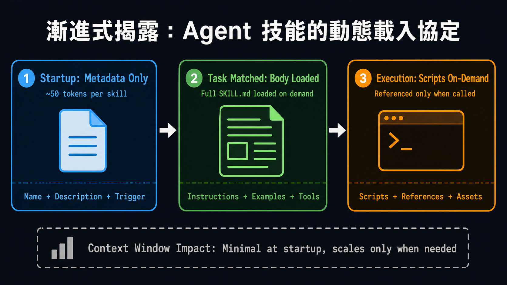

# Day 3 深度導讀 — 圖片規劃與本次 Session 紀錄

## 本次 Session Prompt（2026-06-19）

```
day3 and day4的直播導讀html
要以ai-mentor(或is_mentor,如果有牽涉到資安的話）and deepguide skill，
針對srt中各階段討論次主題去深度導讀，雖然html已完成，還是可以優化，
請幫我審查及規劃（還是不生圖，先規劃生圖逐字稿）
→ phase 1 -> phase 2
→ 1.不要白皮書的中文圖，請規劃適當段落，以及生圖逐字稿，先放readme.md(本次session的prompt也要留存）
   2.day1-day5的codelab，原來的URL內如果有圖檔，請將圖檔網址放到codelab導讀的適當位置
```

---

## 已完成事項（本次 Session）

### Phase 1 — Bug 修正
- [x] Day3 逐字稿 402 turns 講者 badge 修正（7 位講者各自著色）
- [x] 白皮書中文圖片（11 張）從 deep-guide HTML 移除
- [x] 圖片 CSS 樣式（`.fig`）加入 Day3 HTML

### Phase 2 — 深度補寫
- [x] `callout-think` × 3（漸進式揭露真因、Pass@K vs Trajectory、Meta-Skills 安全盲區）

---

## 圖片規劃

### 現況
- 白皮書圖（11 張 `images_cht/`）已從 HTML 移除
- 5 張直播討論專屬插圖已生成並嵌入 HTML

### 圖片位置與生圖逐字稿（已完成）

以下 5 張插圖專為「直播討論觀點」設計，補充白皮書沒有視覺化的核心概念。

---

#### 圖 A：漸進式揭露三層載入架構
**嵌入位置**：`#anatomy` 章節，callout-think 之後

**風格**：水平流程圖，深色背景（#1e1e2e），三個主要節點，白色文字

**生圖逐字稿**：
```
Create a clean dark-background technical diagram showing "Progressive Disclosure" 
in Agent Skills loading. Three horizontal stages connected by arrows:

Stage 1 (left, blue box): "Startup: Metadata Only"
  - Subtitle: "~50 tokens per skill"
  - Icon: small file icon
  - Note below: "Name + Description + Trigger"

Arrow → 

Stage 2 (center, green box): "Task Matched: Body Loaded"
  - Subtitle: "Full SKILL.md loaded on demand"
  - Icon: expanded document icon
  - Note below: "Instructions + Examples + Tools"

Arrow → 

Stage 3 (right, orange box): "Execution: Scripts On-Demand"
  - Subtitle: "Referenced only when called"
  - Icon: terminal/script icon
  - Note below: "Scripts + References + Assets"

Below all three: gray dashed box "Context Window Impact: Minimal at startup, 
scales only when needed"

Color scheme: dark background #1e1e2e, blue #4fc3f7, green #81c784, orange #ffb74d
Style: flat design, monospace font for code snippets, Traditional Chinese labels
Title at top: "漸進式揭露：Agent 技能的動態載入協定"
```

---

#### 圖 B：Context Rot 真因 — 語意重疊 vs Token 量
**嵌入位置**：`#anatomy` 章節，圖 A 之後

**風格**：左右對比圖，錯誤迷思 vs 真因

**生圖逐字稿**：
```
Create a two-panel comparison diagram with Traditional Chinese labels.

Left panel (red border, "❌ 常見誤解"):
  Title: "Token 數量過多 → Context Rot"
  Visual: Stack of token blocks growing tall
  X mark indicating this is WRONG
  Text: "100 技能 × 5K tokens = 問題所在？"
  Answer in red: "❌ 不是這個原因"

Right panel (green border, "✅ 真實原因"):
  Title: "語意相似 → Gradient Interference → Context Rot"
  Visual: Venn diagram showing 15 overlapping skill circles
  Highlight: overlapping area in orange/red = "干擾區"
  Text: "15 個語意相似技能 = 路由器混淆"
  Text below: "即使只有 500K tokens 也會發生"
  Answer in green: "✅ 重疊 > 數量"

Bottom bar: gray background
  "解法：Hierarchical Routing → 先選 Top-10 → 能力分析 → 縮窄到 3-5"
  Arrow showing funnel from 100 → 10 → 5 skills

Source attribution: "Tanvi Singhal, Day 3 AMA"
Style: clean flat design, white background panels, dark text
Title: "Context Rot 的真正觸發因"
```

---

#### 圖 C：評估指標對比 — Pass@K vs Trajectory Consistency
**嵌入位置**：`#evaluation` 章節，callout-think 之後

**風格**：表格式對比圖

**生圖逐字稿**：
```
Create a comparison table diagram with two columns and Traditional Chinese labels.

Header: "為什麼 Pass@K 不夠用？" in bold dark text

Left column header: "Pass@K（成功率）" with ❌ warning icon
  Row 1: "Input → Output 比對"
  Row 2: "10 次中 8 次正確 = 80%"
  Row 3 (highlighted orange): "但每次走的路徑完全不同"
  Row 4: "工具呼叫：3次/7次/未知"
  Row 5 (red): "⚠ 生產環境定時炸彈"

Right column header: "Trajectory Consistency（軌跡一致性）" with ✅ icon
  Row 1: "Input → Tool Call Sequence → Output"
  Row 2: "95%+ 走相同工具路徑 = 可信賴"
  Row 3 (highlighted green): "路徑固定 → 行為可預測"
  Row 4: "工具呼叫：A→B→C (穩定)"
  Row 5 (green): "✅ 真正的技能品質指標"

Bottom section: dark background
  "eval dataset 應記錄：工具呼叫序列 + 最終輸出"
  "不只是 input/output 對"

Source: "Debanshu & Tanvi, Day 3 AMA"
Style: clean table with alternating row colors, icons for each point
Title at top: "評估驅動開發：超越 Pass@K 的真正指標"
```

---

#### 圖 D：Meta-Skills 雙面刃
**嵌入位置**：`#meta-skills` 章節，callout-think 之後

**風格**：左右對稱的雙面刃視覺隱喻

**生圖逐字稿**：
```
Create a "double-edged sword" metaphor diagram with Traditional Chinese labels.

Center: sword/blade icon pointing downward, golden color

Left side (dark teal background): "✨ Meta-Skills 的潛力"
  Flow arrows downward:
  "成功的 execution trajectory"
  ↓
  "Agent 自動分析模式"
  ↓
  "晶化為新 SKILL.md"
  ↓
  "技能庫自動擴張"
  Bottom text: "自我進化 → 持續學習"

Right side (dark red background): "⚠ Meta-Skills 的風險"
  Flow arrows downward:
  "無人審查的自動晶化"
  ↓
  "針對錯誤指標最佳化"
  ↓
  "惡意 execution flow"
  ↓
  "安全漏洞埋入技能庫"
  Bottom text: "失控演化 → 安全災難"

Center bottom: golden box
  "安全閘門：Sandbox → Security Scan → Human Spot-check → Version Sign"

Key insight below: "AI writes draft. Human must verify. Always."
Source: "Debanshu Ghosh, Day 3 AMA"
Style: dark themed, two contrasting colored panels, clear flow arrows
Title: "Meta-Skills：技能自我晶化的雙面刃"
```

---

#### 圖 E：階層式路由架構
**嵌入位置**：`#evaluation` 章節，圖 C 之後

**風格**：漏斗型架構圖

**生圖逐字稿**：
```
Create a funnel/pyramid architecture diagram with Traditional Chinese labels.

Top level (wide, light blue): "技能庫全集"
  "100+ 技能"
  "所有 metadata 摘要"

Arrow down labeled "路由器初篩"

Second level (medium, blue): "語意相關候選"
  "Top-10 技能"
  "依 user intent 語意匹配"

Arrow down labeled "能力分析"

Third level (narrow, dark blue): "精確匹配"
  "3-5 技能"
  "依任務複雜度載入 body"

Arrow down labeled "Context 注入"

Bottom (smallest, navy): "單一任務執行"
  "1-2 活躍技能"
  "Context 影響最小化"

Right side annotation box:
  "關鍵原則：Context 視窗只需容納"
  "能力分析結果（非全庫）"
  "避免語意相似干擾"

Bottom note: "扁平列表（❌）→ 階層式路由（✅）"
Source: "Tanvi Singhal, Day 3 AMA"
Style: gradient blue funnel, clean arrows, white text on dark backgrounds
Title: "階層式技能路由：讓 Context Rot 永遠不發生"
```

---

## 下一步執行順序

1. [x] 使用 Codex CLI 內建 `image_gen` 生成 5 張圖
2. [x] 存放至 `Day3/day3-deep-guide/images/img-A.png` 至 `img-E.png`
3. [x] 在 HTML 指定段落加入 `<figure class="fig">`
4. [x] 完成圖片路徑、HTML 語法與響應式版面 QA

## 2026-06-19 執行結果

- 最新維護指令：`update readme.md`
- 圖 A–E 均為 PNG、1672×941。
- 已逐張檢查構圖、流程方向、主要文字、對比度與網頁可讀性。
- 插入位置：A、B → `#anatomy`；C、E → `#evaluation`；D → `#meta-skills`。
- 生圖方式：Codex CLI 工作階段內使用 `imagegen` skill 的內建 `image_gen`。
- 驗證：HTML parser PASS、本地圖片缺檔 0、桌機與 iPhone 13 視窗 QA PASS。
- 待完成事項：無。

---

## 技術備註

- 圖片 CSS class `.fig` 已在 HTML `<style>` 中定義
- 嵌入格式：
```html
<figure class="fig">
  
  <figcaption><strong>圖 A：標題</strong> — 說明文字。</figcaption>
</figure>
```
