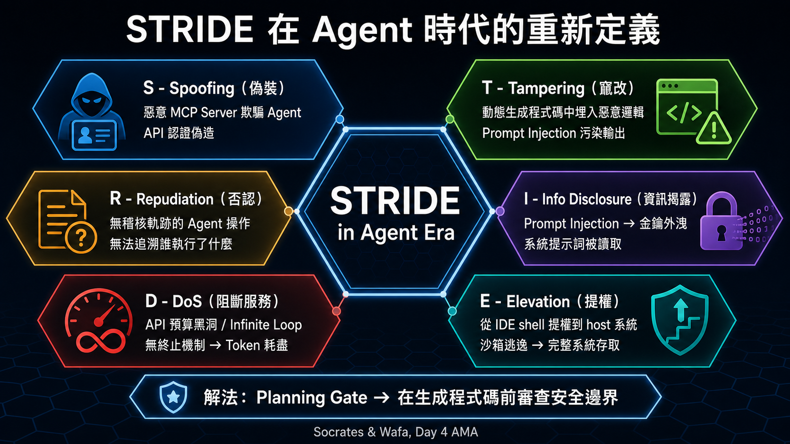

# Day 4 深度導讀 — 圖片規劃與本次 Session 紀錄

## 本次 Session Prompt（2026-06-19）

```
day3 and day4的直播導讀html
要以ai-mentor(或is_mentor,如果有牽涉到資安的話）and deepguide skill，
針對srt中各階段討論次主題去深度導讀，雖然html已完成，還是可以優化，
請幫我審查及規劃（還是不生圖，先規劃生圖逐字稿）
→ phase 1 -> phase 2
→ 1.不要白皮書的中文圖，請規劃適當段落，以及生圖逐字稿，先放readme.md(本次session的prompt也要留存）
   2.day1-day5的codelab，原來的URL內如果有圖檔，請將圖檔網址放到codelab導讀的適當位置
```

---

## 已完成事項（本次 Session）

### Phase 1 — Bug 修正
- [x] Day4 HTML Markdown `**text**` → `<strong>text</strong>` 修正（7 處）
- [x] 白皮書中文圖片（4 張）從 deep-guide HTML 移除
- [x] 圖片 CSS 樣式（`.fig`）加入 Day4 HTML

### Phase 2 — is-mentor 深度補寫
- [x] theme2：三層確定性防禦解析（Deterministic > AI Guardrail）
- [x] theme3：Effective Trust vs 靜態信任 / UEBA 類比

---

## 圖片規劃

### 現況
- 白皮書圖（4 張 `images_cht/`）已從 HTML 移除
- 5 張直播 AMA 安全概念插圖已生成並嵌入 HTML
- Day4 主題為「Vibe Coding 代理程式安全與評估」→ is-mentor 視角

### 圖片位置與生圖逐字稿（已完成）

以下 5 張插圖專為「直播 AMA 討論的安全概念」設計，涵蓋 STRIDE、Safety Harness、Effective Trust、LLM-as-judge 等核心主題。

---

#### 圖 F：Agent 時代的 STRIDE 威脅樹
**嵌入位置**：`#theme1` 章節，第二段（STRIDE 說明）之後

**風格**：六邊形 STRIDE 圖，深色安全主題

**生圖逐字稿**：
```
Create a STRIDE threat model hexagon diagram adapted for AI Agent development.
Use a dark cybersecurity theme with Traditional Chinese labels.

Central hexagon: "STRIDE in Agent Era" (dark navy background, white text)

Six surrounding hexagons, each connected by lines:

Top-left (blue): "S - Spoofing（偽裝）"
  "惡意 MCP Server 欺騙 Agent"
  "API 認證偽造"
  Icon: mask/disguise icon

Top-right (orange): "T - Tampering（竄改）"
  "動態生成程式碼中埋入惡意邏輯"
  "Prompt Injection 污染輸出"
  Icon: wrench/tamper icon

Right (purple): "R - Repudiation（否認）"
  "無稽核軌跡的 Agent 操作"
  "無法追溯誰執行了什麼"
  Icon: eraser icon

Bottom-right (red): "I - Info Disclosure（資訊揭露）"
  "Prompt Injection → 金鑰外洩"
  "系統提示詞被讀取"
  Icon: leaked document icon

Bottom-left (yellow): "D - DoS（阻斷服務）"
  "API 預算黑洞 / Infinite Loop"
  "無終止機制 → Token 耗盡"
  Icon: infinite loop icon

Left (green): "E - Elevation（提權）"
  "從 IDE shell 提權到 host 系統"
  "沙箱逃逸 → 完整系統存取"
  Icon: up-arrow / escalation icon

Bottom annotation: "解法：Planning Gate → 在生成程式碼前審查安全邊界"
Source: "Socrates & Wafa, Day 4 AMA"
Style: dark background #0d1117, hexagon grid, each hex has subtle gradient
Title: "STRIDE 在 Agent 時代的重新定義"
```

---

#### 圖 G：Safety Harness 三層確定性防禦架構
**嵌入位置**：`#theme2` 章節，is-mentor callout 之後

**風格**：同心圓洋蔥架構圖

**生圖逐字稿**：
```
Create a concentric circles "onion architecture" security diagram with Traditional 
Chinese labels and dark cybersecurity theme.

Outermost ring (dark gray): "Layer 1：網路層確定性限制"
  Left annotation: "NAT Gateway 白名單出口"
  Right annotation: "任何 Agent 無法繞過"
  Color: #37474f

Middle ring (dark teal): "Layer 2：沙箱 JIT 稽核"
  Left annotation: "每個 shell 指令動態審查"
  Right annotation: "異常行為即時阻斷"
  Color: #004d40

Inner ring (dark blue): "Layer 3：AI 防護欄"
  Left annotation: "處理語義模糊案例"
  Right annotation: "最後防線，非主要防禦"
  Color: #1a237e

Center circle (white): "Agent 執行區"
  Text: "Stateless + Read-only"
  Icon: robot/agent icon

Right side annotation box (dark background):
  "關鍵原則"
  "Layer 1+2 = 確定性 = 不可幻覺"
  "Layer 3 = AI = 可能幻覺"
  "→ 永遠以確定性規則為基礎"

Bottom: "即使所有 AI Guardrail 同時失效，Layer 1+2 仍然成立"
Source: "Socrates Nguyen, Day 4 AMA"
Style: clean concentric circles, contrasting ring colors, white labels
Title: "Safety Harness：三層確定性防禦架構"
```

---

#### 圖 H：Effective Trust 滑動窗口
**嵌入位置**：`#theme3` 章節，is-mentor callout 之後

**風格**：時間軸 + 信任分數折線圖

**生圖逐字稿**：
```
Create a time-series trust score visualization with Traditional Chinese labels.

Main chart area (dark background):
  X-axis: "時間 / 互動輪次" (showing turns 1 through 20)
  Y-axis: "有效信任分數" (0 to 100%)
  
  Line 1 (green): "正常行為期" (turns 1-10, stays 80-95%)
    Smooth line in safe zone
  
  Dashed horizontal line at 70%: "安全閥值" (red dashed line)
  
  Line 2 (orange → red): "Prompt Injection 後" (turns 11-20)
    Gradually declining from 75% to 45%
    Drops below threshold at turn 15
  
  At turn 15: vertical red line + alert icon
    Label: "⚠ 閾值觸發"
    Action box: "Human-in-the-loop 閘道啟動"
    "Agent 自主執行暫停"
  
  Sliding window bracket: shows window covering turns 12-17
    Label: "滑動窗口 N=5"
  
  Annotation arrows:
    Turn 11: "憑證仍有效 ✓"
    Turn 11: "但行為已偏移 ✗"
    → "靜態信任無法偵測此攻擊"
    → "Effective Trust 可以"

Right side legend box:
  Green: "正常決策品質"
  Orange: "意圖偏移（Intent Drift）"
  Red dashed: "安全閥值"
  Blue bracket: "滑動窗口"

Bottom text: "類比：UEBA（User Entity Behavior Analytics）引入 AI Agent 監控"
Source: "Day 4 AMA - Effective Trust Concept"
Style: dark chart background, neon-style lines, grid lines visible
Title: "Effective Trust 滑動窗口：動態信任計算機制"
```

---

#### 圖 I：Deterministic vs AI Guardrail 對比
**嵌入位置**：`#theme2` 章節，圖 G 之前

**風格**：左右雙柱對比圖

**生圖逐字稿**：
```
Create a two-column comparison diagram with Traditional Chinese labels.
Dark background with contrast colors.

Left column header: "AI Guardrail" with ⚠ icon (orange background)
  Property rows:
  "可能產生幻覺 ⚠"
  "語義理解 ✓"
  "可被 Prompt Injection 繞過 ⚠"
  "延遲高（需 LLM 推理）⚠"
  "適用：語義層面模糊判斷 ✓"
  Bottom: border with "連鎖崩潰風險" label

Right column header: "確定性規則" with ✅ icon (green background)
  Property rows:
  "不會幻覺 ✅"
  "規則明確 ✅"
  "無法被語言繞過 ✅"
  "延遲低（直接執行）✅"
  "適用：網路邊界、加密、存取控制 ✅"
  Bottom: border with "基礎防禦成立" label

Center divider: "vs"

Bottom synthesis box (blue background):
  "正確架構：確定性規則為基礎 + AI Guardrail 為補充"
  "錯誤架構：完全依賴 AI Guardrail"
  
  Visual: two pillars, left (solid, labeled "確定性") taller than 
  right (dashed, labeled "AI")

Source: "Socrates & Wafa, Day 4 AMA"
Title: "為什麼不能只靠 AI Guardrail？"
```

---

#### 圖 J：LLM-as-Judge 軌跡評估流程
**嵌入位置**：`#theme4` 章節，圖片列表之後

**風格**：水平流程圖 + 評分維度

**生圖逐字稿**：
```
Create a "Glass Box Evaluation" flow diagram with Traditional Chinese labels.

Top section: "黑盒測試（傳統）" with ❌ label
  Simple: [Input] → [Agent] → [Output]
  Evaluation arrow pointing only to Output
  Label: "只比對最終輸出 → 危險推理路徑被忽略"
  Red X mark

Dividing line

Bottom section: "玻璃盒軌跡評估（Agent 時代）" with ✅ label

Main flow (left to right):
  [Input] 
    ↓
  [Agent - Step 1] → labeled box: "Tool A: search_api()"
    ↓  
  [Agent - Step 2] → labeled box: "Tool B: filter_results()"
    ↓
  [Agent - Step 3] → labeled box: "Tool C: generate_report()"
    ↓
  [Output]

Judge Model positioned on the right side, with evaluation arrows pointing 
to each step:
  → Step 1: "推理合理性 Score: 0.92 ✓"
  → Step 2: "工具選擇效率 Score: 0.85 ✓"  
  → Step 3: "意圖對齊度 Score: 0.78 ⚠"
  → Output: "最終正確率 Score: 0.95 ✓"

Warning annotation at Step 3:
  "⚠ 此步驟推理路徑偏移"
  "即使 Output 正確，內部推理已出現問題"

Bottom insight box:
  "Meltem 觀點：正確的最終輸出可能隱藏危險且漏洞百出的內部推理"
  "→ 必須評估每個 tool call 的意圖對齊度，而非只看輸出"

Source: "Meltem & Wafa, Day 4 AMA"
Style: clean technical diagram, dark background, color-coded score indicators
Title: "打開玻璃盒：LLM-as-Judge 軌跡評估流程"
```

---

## 下一步執行順序

1. [x] 使用 Codex CLI 內建 `image_gen` 生成 5 張圖
2. [x] 存放至 `Day4/day4-deep-guide/images/img-F.png` 至 `img-J.png`
3. [x] 在 HTML 指定段落加入 `<figure class="fig">`
4. [x] 完成圖片路徑、HTML 語法與響應式版面 QA

## 2026-06-19 執行結果

- 最新維護指令：`update readme.md`
- 圖 F–J 均為 PNG、1672×941。
- F、G、H、J 依初稿檢查結果各完成一次針對性修正；I 初稿直接採用。
- 已逐張檢查 STRIDE 對應、分層防禦、信任閾值、確定性規則對比與軌跡評分流程。
- 插入位置：F → `#theme1`；I、G → `#theme2`；H → `#theme3`；J → `#theme4`。
- 生圖方式：Codex CLI 工作階段內使用 `imagegen` skill 的內建 `image_gen`。
- 驗證：HTML parser PASS、本地圖片缺檔 0、桌機與 iPhone 13 視窗 QA PASS。
- 待完成事項：無。

---

## 技術備註

- 圖片 CSS class `.fig` 已在 HTML `<style>` 中定義
- 嵌入格式：
```html
<figure class="fig">
  
  <figcaption><strong>圖 F：標題</strong> — 說明文字。</figcaption>
</figure>
```
